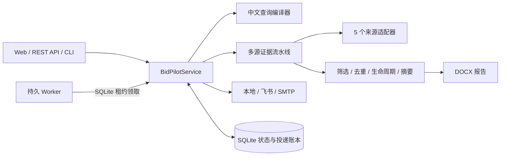

# 标擎 BidPilot

标擎是一个证据优先的招投标情报 Agent：把中文自然语言编译成可审计的检索或长期订阅任务，并从真实来源采集、筛选、去重、生成 Word 报告，再按用户选择的渠道投递。

项目面向 2026 AI 先锋未来人才大赛超聚变“招投标信息聚合工具”命题，但按可长期运行的真实工程建设，不依赖 Windows 计划任务或 PowerShell 服务脚本。

## 已实现能力

- 中文查询编译：主题、同义词、地域、时间范围、每日/每周/一次性计划、投递渠道。
- 5 个来源适配器：公开源、官方源和用户主动授权的免费会员源。
- 证据优先流水线：正文清洗、附件提取、严格筛选、跨站去重、项目生命周期聚类、机会评分。
- 安全摘要：默认离线抽取；可选 OpenAI-compatible 模型，事实无法回指证据时自动降级。
- DOCX 报告：保留查询口径、来源覆盖、原文链接、附件和证据片段。
- 持久订阅：SQLite 保存下次执行时间、运行历史、投递尝试、失败次数、worker 心跳和租约。
- 故障恢复：重启补跑、失败退避、长任务续租、多 worker 互斥、手动/自动执行防重入。
- 用户管理：编辑自然语言规则、暂停/恢复、立即执行、通知策略、投递渠道、日志和二次确认删除。
- 投递渠道：本地报告中心、飞书群机器人、飞书应用文件、SMTP 邮件附件。
- 来源中心：展示接入模式、授权边界、最近状态、实际抓取数和保留数。

> “不重复”指应用在收到渠道成功确认后登记版本账本，后续不再发送同一公告版本。任何外部网络系统都存在“对方已收到但本端未收到确认”的极小不确定窗口，项目不虚假宣称分布式绝对恰好一次。

## 架构



本地开发默认由 Web 进程内嵌 worker，开箱即用；生产 Compose 将 Web 与 worker 分成两个可自动重启的进程，共享同一个 SQLite 数据卷和报告卷。

## 跨平台快速开始

要求 Python 3.11+。`bootstrap.py` 仅使用 Python 标准库，可在 Windows、macOS 和 Linux 运行。

```text
python bootstrap.py --dev
```

启动应用：

```text
# Windows
.venv\Scripts\python.exe -m bidpilot serve

# macOS / Linux
.venv/bin/python -m bidpilot serve
```

打开 <http://127.0.0.1:8000>，API 文档位于 <http://127.0.0.1:8000/docs>。

常用命令：

```text
python -m bidpilot parse "最近1个月江苏服务器招标信息，每天9点发送"
python -m bidpilot run "最近1个月江苏服务器招标信息"
python -m bidpilot sources
python -m bidpilot worker
python -m bidpilot openapi
```

如未激活虚拟环境，请把命令中的 `python` 换成上面的平台对应解释器路径。

## Docker Compose

安装 Docker Desktop 或 Docker Engine + Compose 后：

```text
docker compose up -d --build
docker compose ps
docker compose logs -f worker
```

Compose 使用命名卷持久化 `/app/data` 与 `/app/outputs/reports`，并对 Web 和 worker 配置 `restart: unless-stopped`。端口默认只绑定 `127.0.0.1`；项目当前不内置多用户登录，不应直接暴露到公网。需要公网飞书下载时，请通过带 TLS 和访问控制的反向代理发布，并设置 `BIDPILOT_PUBLIC_BASE_URL`。

本机当前环境没有 Docker，因此仓库不会声称镜像已在本机完成构建验证；CI 和有 Docker 的交付环境仍需实际执行上述命令。

## 长期任务如何工作

1. 创建订阅时先把规则和 `next_run_at` 写入 SQLite。
2. worker 定期心跳，并通过原子事务领取到期任务。
3. 执行期间持续续租，其他 worker 无法重复领取。
4. 报告和渠道确认成功后，才把公告版本写入投递账本。
5. 失败不会写账本，并按 1 分钟、5 分钟、15 分钟、1 小时、3 小时退避重试。
6. 进程重启后，新的 worker 从 SQLite 恢复到期任务；过期租约可被安全接管。

这套机制不依赖操作系统计划任务。单机可运行 `serve` 的内嵌 worker；生产建议使用 Compose 的独立 worker。

## 用户如何管理

Web 的“订阅中心”支持：

- 查看长期任务服务是否在线、当前执行数、到期等待数；
- 编辑订阅名称和完整自然语言规则，自动重算下次时间；
- 切换“每轮回执 / 仅变化通知”和已配置投递渠道；
- 暂停后续、恢复、立即执行；
- 查看每次自动/手动运行、发现数、新增数、错误和报告链接；
- 两次点击确认后删除订阅及其增量账本。

“来源中心”用于查看来源健康与授权边界；未授权来源不会被伪装成成功。

## 来源与边界

| 来源 | 模式 | 当前边界 |
|---|---|---|
| 中国招标投标网 | 公开搜索 + 可选会员增强 | 未提供 Cookie 时保留公开摘要并标记部分覆盖 |
| 中国政府采购网 | 官方公开源 | 公告列表、详情和附件 |
| 全国公共资源交易平台 | 官方公开源 | 当前读取首页最新公告流，不等同于全量历史检索 |
| 商务部中国国际招标网 | 官方公开源 | 机电产品招标公告列表和详情 |
| 千里马招标网 | 用户授权免费会员源 | 未授权时明确返回 `auth_required`，不绕过登录或付费权限 |

授权千里马免费会员会话：

```text
python bootstrap.py --auth
python -m playwright install chromium
python -m bidpilot auth qianlima
```

登录会话仅保存到 `data/secrets/`，该目录已被 Git 忽略。

## 配置投递

复制 `.env.example` 为 `.env`，只填写需要的渠道。未配置渠道会在界面禁用，系统不会创建虚假推送承诺。

- 飞书 Webhook：`BIDPILOT_FEISHU_WEBHOOK_URL`
- 飞书应用：`BIDPILOT_FEISHU_APP_ID`、`BIDPILOT_FEISHU_APP_SECRET`、`BIDPILOT_FEISHU_RECEIVE_ID`
- SMTP：`BIDPILOT_SMTP_HOST`、`BIDPILOT_SMTP_FROM`、`BIDPILOT_SMTP_TO`，按服务商选择 `ssl` 或 `starttls`
- 可选模型：`BIDPILOT_LLM_BASE_URL`、`BIDPILOT_LLM_API_KEY`、`BIDPILOT_LLM_MODEL`

请使用邮箱服务商提供的应用专用密码，不要把 `.env`、Cookie 或密钥提交到 Git。

## 开发与验证

```text
python -m ruff check .
python -m pytest
node --check bidpilot/static/app.js
```

仓库包含 Windows、macOS、Linux 的 GitHub Actions 测试矩阵。真实网络来源会随站点结构变化，解析单测使用保存的最小夹具，端到端验收则必须保留真实运行记录和来源诊断。

## 合规原则

- 仅访问公开信息或用户主动授权的免费会员可见信息。
- 不绕过验证码、付费墙、访问控制或网站条款。
- 不硬编码比赛示例结果，不用无关内容填充“看起来丰富”的报告。
- 每条摘要保留原始链接与证据片段；覆盖不完整时明确披露。
- 登录态、Cookie、API 密钥和邮箱密码只保存在本机或部署密钥系统。

产品与验收范围见 [SPEC.md](SPEC.md)，当前工程进度见 [progress.md](progress.md)。
