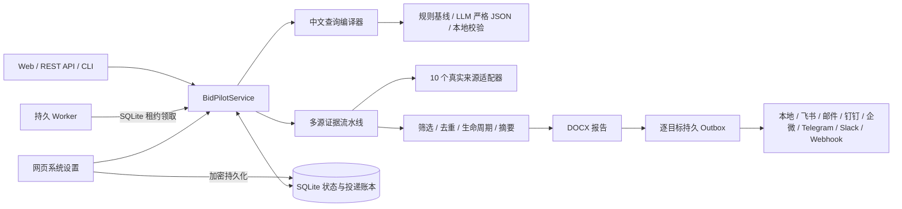

# 标擎 BidPilot

当前稳定版本：**v0.8.0** · 默认本机地址：<http://127.0.0.1:8000>

标擎给招投标情报专员一条更短的工作路径：输入一句需求，先确认主题、地域、时间和频率，再从多个公告站点找回原文、筛掉无关内容并生成 Word。值得跟进的项目可以直接分配负责人和下一步；定时任务只交付新增或变化。

项目面向 2026 AI 先锋未来人才大赛超聚变“招投标信息聚合工具”命题，也按企业单机或 Linux 服务器长期运行设计，不依赖 Windows 计划任务或 PowerShell 服务脚本。

一次完整工作回答四个问题：查到了什么、为什么留下、原文在哪里、下一步由谁做。来源失败、登录过期和字段缺失会出现在结果里，不会被一段看似完整的摘要盖过去。

## 从问题到行动

- **先确认口径。** 中文问题会拆成主题、同义词、地域、日期、公告类型、排除词和执行频率。每日、每周、每月问题由首页主按钮直接创建持久订阅；即时问题进入当次检索。
- **再查真实来源。** 10 个适配器覆盖国家公开源、广东/深圳地域官方源和用户本人授权的免费会员入口。每个来源单独记录扫描、候选、保留、跳过和失败，不用“已接入”冒充本轮有贡献。
- **筛选结果而不是堆结果。** 日期、地域、阶段和排除词先由程序硬过滤，再做主题召回、可选语义复核、跨站去重和项目生命周期聚合。0 条结果会保留淘汰漏斗和覆盖缺口。
- **交付能复核的 Word。** 报告保留问题口径、来源状态、标题、发布时间、采购单位、核心内容、原文和附件；没有附件就明确标注，不由模型补齐。
- **把信息交给下一位责任人。** 结果可加入机会，保存阶段、负责人、下一步、计划时间、标签和备注；后续更正或中标更新证据时间线，不覆盖人的跟进字段。
- **长期任务只处理新增。** SQLite 保存订阅、worker 租约、运行历史和公告版本账本。报告与逐目标 Outbox 先落库，再分别发送、确认、重试和进入死信；一个渠道失败不会拖着成功渠道重发。
- **模型是可选助手，不是事实源。** 默认可离线抽取；启用 OpenAI-compatible 模型后，它可以建议检索词、复核边缘候选、写受约束摘要和适配解释，但不能改写记录身份、URL、日期或无证据数字。
- **部署边界写在产品里。** 默认仅本机访问；临时 LAN 和企业 HTTPS 模式分别有明确门禁。模型、来源预算、worker、飞书、邮件和其他通知渠道均可在网页配置，敏感值加密且不回显。

> “不重复”指应用在收到渠道成功确认后登记版本账本，后续不再发送同一公告版本。任何外部网络系统都存在“对方已收到但本端未收到确认”的极小不确定窗口，项目不虚假宣称分布式绝对恰好一次。

## 架构



本地开发默认由 Web 进程内嵌 worker，开箱即用；生产 Compose 将 Web 与 worker 分成两个可自动重启的进程，共享同一个 SQLite 数据卷和报告卷。

Linux 生产环境同时提供 hardened `systemd` Web/worker 单元：专用非特权用户、`UMask=0077`、只读系统、私有临时目录、仅允许写入数据与报告目录。完整安装、升级、备份与千里马安全图形登录流程见 [Linux 部署与运维手册](docs/LINUX_DEPLOYMENT.md)；真实跨平台证据见 [跨平台测试与审计报告](docs/CROSS_PLATFORM_TEST_AUDIT.md)。

## 跨平台快速开始

要求 Python 3.11+。`bootstrap.py` 仅使用 Python 标准库，可在 Windows、macOS 和 Linux 运行。

```text
python bootstrap.py --dev
```

启动应用：

```text
# Windows
.venv\Scripts\python.exe -m bidpilot serve

# macOS / Linux
.venv/bin/python -m bidpilot serve
```

打开 <http://127.0.0.1:8000>，API 文档位于 <http://127.0.0.1:8000/docs>。

下面用 `{PY}` 表示当前项目解释器：Windows 为 `.venv\Scripts\python.exe`，macOS/Linux 为 `.venv/bin/python`。常用命令：

```text
{PY} -m bidpilot parse "最近1个月江苏服务器招标信息，每天9点发送"
{PY} -m bidpilot run "最近1个月江苏服务器招标信息"
{PY} -m bidpilot status
{PY} -m bidpilot stop
{PY} -m bidpilot restart
{PY} -m bidpilot sources
{PY} -m bidpilot worker
{PY} -m bidpilot openapi
```

如未激活虚拟环境，生命周期命令必须和启动使用同一个 `.venv` 解释器：

```text
# Windows
.venv\Scripts\python.exe -m bidpilot status
.venv\Scripts\python.exe -m bidpilot stop
.venv\Scripts\python.exe -m bidpilot restart

# macOS / Linux
.venv/bin/python -m bidpilot status
.venv/bin/python -m bidpilot stop
.venv/bin/python -m bidpilot restart
```

`serve` 是前台服务：启动它的终端窗口需要保持打开。停止时可在该窗口按 `Ctrl+C`，也可在另一个终端运行启动画面打印的准确 `stop` 命令。服务会显示版本、数据库、报告目录和控制目录；`stop` 使用控制目录中的本机令牌优雅退出，不按 PID 强杀进程。业务数据库可迁移到其他目录，但控制记录默认固定在项目的 `data/`，所以正常情况下无需重复设置临时环境变量。完整到逐点击级别的说明见 [零基础操作说明书](docs/BEGINNER_MANUAL.md)。

### 原生 Python 怎样改端口、重启和停止

只有使用上面的 `.venv` 命令启动时，网页“系统设置 → 长期任务与局域网 → 服务端口”才控制监听端口。把端口从 8000 改为 8012 并保存后，页面会提示“等待重启”；然后执行：

```text
# Windows：让新端口生效 / 停止服务
.venv\Scripts\python.exe -m bidpilot restart
.venv\Scripts\python.exe -m bidpilot stop

# macOS / Linux：让新端口生效 / 停止服务
.venv/bin/python -m bidpilot restart
.venv/bin/python -m bidpilot stop
```

重启完成后访问 `http://127.0.0.1:8012`。如果只是想临时停止，也可以回到运行 `serve` 的终端按 `Ctrl+C`。

## Docker Compose

安装 Docker Desktop 或 Docker Engine + Compose 后：

```text
docker compose up -d --build
docker compose ps
docker compose logs -f worker
```

Docker Compose 有两层端口：容器内 Web 服务固定监听 `8000`，宿主机入口由项目根目录 `.env` 中的 `BIDPILOT_PORT` 映射。网页“服务端口”只控制原生 Python `bidpilot serve`；它不会修改 `.env` 或 `compose.yaml`，也不会改变已经创建的 Compose 容器。

例如要让 Docker 版从 `http://127.0.0.1:8000` 改到 `http://127.0.0.1:8012`：

1. 用文本编辑器打开项目根目录的 `.env`，加入或修改一行 `BIDPILOT_PORT=8012`。
2. 保存文件，在项目根目录执行 `docker compose up -d --force-recreate`。端口映射只在重新创建容器后改变。
3. 打开 `http://127.0.0.1:8012`。不要再用网页端口字段覆盖它。

Docker 版的停止与重启命令：

```text
# 暂停全部容器；数据仍保留
docker compose stop

# 继续运行已暂停的容器；端口映射不变
docker compose start

# 配置没有变化时，普通重启
docker compose restart

# 改过 BIDPILOT_PORT 后，必须重新创建容器
docker compose up -d --force-recreate

# 停止并移除容器和项目网络；不要加 -v，命名卷中的数据会保留
docker compose down
```

Compose 使用命名卷持久化 `/app/data` 与 `/app/outputs/reports`，并对 Web 和 worker 配置 `restart: unless-stopped`。端口默认只绑定 `127.0.0.1`；项目当前不内置多用户登录，不应直接暴露到公网。需要公网报告下载时，请通过带 TLS 和访问控制的反向代理发布，并在网页系统设置填写公网报告地址。

公司内网服务器请使用独立的企业 Compose 文件，而不是修改基础 Compose 去裸露 8000 端口：

```bash
export BIDPILOT_SERVER_NAME=bidpilot.example.internal
export BIDPILOT_TRUSTED_CLIENT_NETWORKS=10.20.0.0/16
export BIDPILOT_LAN_ADMIN_TOKEN='至少16位随机值'
export BIDPILOT_TLS_CERT_DIR=/etc/bidpilot/tls
docker compose -f deploy/compose/compose.enterprise.yaml config
docker compose -f deploy/compose/compose.enterprise.yaml up -d --build
```

该模式只发布 Nginx 的 443，后端 8000 留在隔离的内部 Docker 网络；Web/worker 另接仅出站的 bridge 网络访问受控互联网来源，不发布任何业务端口。所有业务 API（包括读取）同时校验 HTTPS、客户端私有网段、浏览器 Origin 和管理员令牌。`X-Forwarded-*` 只有来自固定代理子网时才参与判断。证书目录必须包含 `fullchain.pem` 和 `privkey.pem`；生产令牌应来自组织密钥系统，不能提交到仓库或写进 Compose 文件。

启动环境直接声明 `BIDPILOT_NETWORK_ACCESS_MODE=enterprise` 时，网络模式、策略、网段、代理、Origin、管理员令牌和端口会被环境强制锁定；旧数据库或网页配置不能把生产实例降级为 LAN/免令牌，页面对应控件保持只读。

本机当前环境没有 Docker，因此仓库不会声称镜像已在本机完成构建验证；CI 和有 Docker 的交付环境仍需实际执行上述命令。

## 长期任务如何工作

1. 创建订阅时先把规则和 `next_run_at` 写入 SQLite。
2. worker 定期心跳，并通过原子事务领取到期任务。
3. 执行期间持续续租，其他 worker 无法重复领取。
4. 报告记录、全部目标 Outbox 和各目标公告集合在首次外发前一次性写入 SQLite。
5. 每个目标单独领取、发送和确认；成功目标与该目标公告账本在同一事务提交。
6. 临时失败只重试该目标；平台给出 `Retry-After` 时绝不提前，五次失败进入可见死信。
7. 进程重启后，新的 worker 继续未完成 Outbox；过期租约可接管，旧 lease token 不能覆盖新状态。

这套机制不依赖操作系统计划任务。单机可运行 `serve` 的内嵌 worker；生产建议使用 Compose 的独立 worker。

## 用户如何管理

Web 的“自动订阅”支持：

- 查看长期任务服务是否在线、当前执行数、到期等待数；
- 编辑订阅名称和完整自然语言规则；规则变化时先确认主题、地域、时间与计划，再用签名快照保存并重算下次时间，避免二次模型解析漂移；
- 切换“每轮回执 / 仅变化通知”，并同时选择多个已配置目标；
- 暂停后续、恢复、立即执行；
- 查看每次自动/手动运行、发现数、新增数、报告链接以及每个目标的成功、等待重试、死信和平台回执；
- 修复渠道配置后，只把该死信目标重新排队，不重新抓取，也不重发已成功目标；
- 两次点击确认后删除订阅及其增量账本。

Web 的“机会跟进”支持：

- 从真实查询结果加入机会；服务端只接受已经写入证据库的标讯 ID，不能由浏览器伪造项目快照；
- 同一项目重复加入仍返回原机会，不产生重复销售线索；
- 搜索项目、采购人、负责人、备注或标签，并按阶段查看横向看板；
- 管理待评估、跟进中、投标准备、已中标、未中标和归档阶段；
- 设置负责人、下一步时间、标签、跟进备注和已读/未读状态；
- 查看同一项目的采购意向、招标、更正、中标和合同时间线及原文证据；
- 新生命周期事件自动更新卡片并标为未读，同时保留人工跟进信息；进程重启后状态不丢失；
- “归档保留”让卡片退出日常视线但保留全部人工字段；“删除卡片”二次确认后只移除工作台行，不删除原始标讯、运行证据、报告或反馈，同一标讯以后仍可重新加入；
- 切换到“买方雷达”查看本地采购单位识别覆盖率、公告/版本/估算项目数、生命周期、高频主题和近期原文，并从真实买方创建 `buyer_keywords` 锁定的长期监控。

“来源状态”用于查看来源健康与授权边界；未授权来源不会被伪装成成功。

## 来源与边界

| 来源 | 模式 | 当前边界 |
|---|---|---|
| 中国招标投标网 | 公开搜索 + 可选会员增强 | 未验证会话只保留公开摘要；真实搜索与免费会员详情均验证通过后才启用增强 |
| 中国政府采购网 | 官方公开源 | 公告列表、详情和附件 |
| 全国公共资源交易平台 | 官方公开源 | 当前读取首页最新公告流，不等同于全量历史检索 |
| 商务部中国国际招标网 | 官方公开源 | 机电产品招标公告列表和详情 |
| 千里马招标网 | 行业公开分类 + 持久免费会员浏览器检索 | 用户本人在可见图形会话登录；即时任务沿用独立持久 profile，Linux 无显示后台可复用已验证配置做有界无头检索；默认最多 2 页/40 条、30 秒冷却、每日 24 次，不导出/HTTP 重放 Cookie、不读付费详情；会员监控默认关闭 |
| 中国招标投标公共服务平台 | 官方公开列表 + 用户授权详情入口 | 公开关键词列表可检索；不绕过详情站 WAF、验证码或会员权限 |
| 中央政府采购网 | 官方公开源 | 官方关键词搜索；当前不承诺自动补齐全部详情正文 |
| 军队采购网 | 官方公开列表 + 用户授权工作台入口 | 只使用公开公告；登录、CA 与角色工作台由用户本人操作 |
| 广东省政府采购网 | 地域官方公开源 | 广东 21 个地市路由、全文搜索、详情正文和附件 |
| 深圳公共资源交易中心 | 地域官方公开源 | 深圳公开关键词检索、分页、详情和日期筛选 |

需要为中国招标投标网或千里马完成可见浏览器授权时：

```text
python bootstrap.py --auth
# Windows
.venv\Scripts\python.exe -m bidpilot auth cecbid
# macOS / Linux
.venv/bin/python -m bidpilot auth cecbid
```

也可在 Web“来源状态”点击授权。登录窗口始终在运行 BidPilot 的电脑上打开，局域网手机可以管理开始/完成/测试/清除，但不会把平台 Cookie 传给手机。点击“完成授权”后，网页会自动验证站内搜索与免费会员详情；只有验证通过的会话才会进入后台检索。捕获未验证、无法判定、失败或过期状态均不会显示为“已授权增强”。登录会话仅加密保存在本机数据库与 `data/secrets/` 密钥中；该目录已被 Git 忽略。

千里马使用不同的持久浏览器模式：执行 `python bootstrap.py --auth` 后，在来源状态点击“在系统内免费登录”，由用户本人在可见图形会话扫码或输入账号。验证通过后，即时任务可打开同一个持久 profile；Linux systemd 无图形会话时，`auto` 模式仅复用已验证配置启动有界 headless Chromium。默认上限是 2 页、40 条、30 秒冷却和每日 24 次查询，每次仍会检查原站真实登录状态；会员 Cookie 不会被导出或交给 HTTP 客户端，适配器不会进入付费详情。浏览器配置和只含查询摘要的用量账本保存在 `data/browser_profiles/qianlima/`，已被 Git 忽略；来源状态“清除”会删除该本机配置。

会员监控默认关闭，长期订阅继续使用公开分类流。只有部署方已经取得千里马书面授权或官方 API 权利，才可同时设置 `BIDPILOT_QIANLIMA_MEMBER_MONITORING_ENABLED=true` 和非空的 `BIDPILOT_QIANLIMA_MEMBER_MONITORING_AUTHORIZATION_REFERENCE`；后者填写合同、API 或变更记录编号，不填写账号凭据。配置开关不替代授权材料，未满足门禁时应用拒绝启动。

## 网页系统设置

打开 Web 后进入“系统设置”，可直接配置：

- OpenAI-compatible API 地址、模型名、API Key 和超时；
- 混合意图模式（关闭/自动/每次复核）和置信阈值；
- AI 检索规划模式、最多检索轮次、每来源查询预算、语义复核开关与阈值；
- AI 情报简报模式与单轮处理上限；
- 企业适配判断模式与单轮处理上限；
- 默认 8000 端口、本机/LAN 访问范围、管理员令牌保护或可信私网免令牌模式；
- 独立“报告发布与下载链接”卡：为飞书、钉钉、企微、Slack 和超大 Telegram 文件共用安全 HTTPS 地址；
- 飞书群机器人与签名、飞书应用与接收 ID；
- SMTP SSL/STARTTLS、发件人与多收件人；
- 钉钉群机器人与加签；
- 企业微信群机器人；
- 通用 Webhook 与可选 Bearer Token。
- Telegram Bot Token、Chat ID、可选话题 ID、静默发送和内容保护；
- Slack 官方 Incoming Webhook（消息与报告链接，不伪装支持附件）。

普通字段保存后立即生效，网络范围、LAN 策略、可信网段、管理员令牌和端口在重启后生效；所有网页配置重启后仍保留。密钥、密码和 Webhook 使用本机密钥加密后写入 SQLite，读取接口只返回“已配置”；敏感输入留空表示保持原值，清除必须显式勾选。模型和每个通道都有真实连通性测试，其中通道测试会在二次确认后真实外发。

环境变量和 `.env` 仍可用于容器/自动部署，但不再是日常配置的必经步骤。详见 [系统设置指南](docs/CONFIGURATION_GUIDE.md) 和 [投递渠道指南](docs/DELIVERY_CHANNELS.md)。

### 可选局域网访问

默认仍是 `127.0.0.1:8000`。如需手机或其他电脑使用，在系统设置“长期任务与局域网”选择 LAN，并选择：

- 管理员令牌保护（推荐）：远端写操作首次要求令牌；
- 可信局域网免令牌：仅直连私网设备可完整管理查询、订阅、配置和来源授权。

保存后页面会同时显示当前值和重启后值。Windows 运行 `.venv\Scripts\python.exe -m bidpilot restart`，macOS/Linux 运行 `.venv/bin/python -m bidpilot restart`。LAN 使用普通 HTTP，不要端口映射到公网。自动部署可在 `.env` 设置 `BIDPILOT_NETWORK_ACCESS_MODE`、`BIDPILOT_LAN_ACCESS_POLICY`、`BIDPILOT_LAN_TRUSTED_NETWORKS` 和可选管理员令牌。

长期运行在公司服务器上时，选择 `enterprise`，并通过 Nginx/零信任网关提供 HTTPS。企业模式不提供“可信网段免令牌”：即使客户端来自允许 CIDR，业务 API 仍必须携带管理员令牌；代理头只接受 `BIDPILOT_TRUSTED_PROXY_NETWORKS` 中的直连节点，浏览器 Origin 必须精确命中 `BIDPILOT_ENTERPRISE_ALLOWED_ORIGINS`。后端可绑定明确的内网地址或 `0.0.0.0`，但 8000 端口仍应由主机防火墙限制为仅网关可达。

## 开发与验证

```text
python -m ruff check .
python -m pytest
node --check bidpilot/static/app.js
```

仓库包含 Windows、macOS、Linux × Python 3.11/3.13 的 GitHub Actions 测试矩阵；Ubuntu 作业还校验基础/企业 Compose、构建带 Chromium 的 Linux 镜像并启动企业 HTTPS 栈。2026-08-11 当前工作树已扩展到 311 项测试，并通过 Ruff、Python 编译、JavaScript 语法与发布结构门禁；上一已提交基线的 7 个 CI 作业全部成功，当前版本仍以最终 main 提交的新 7/7 结果为远端发布证据。真实网站会随结构、频率和授权变化，解析单测使用保存的最小夹具，端到端验收必须保留真实运行记录和来源诊断。

## 合规原则

- 仅访问公开信息或用户主动授权的免费会员可见信息。
- 不绕过验证码、付费墙、访问控制或网站条款。
- 不硬编码比赛示例结果，不用无关内容填充“看起来丰富”的报告。
- 每条摘要保留原始链接与证据片段；覆盖不完整时明确披露。
- 登录态、Cookie、API 密钥和邮箱密码只保存在本机或部署密钥系统。

## 完整文档

- [零基础项目交接手册](docs/交接手册_v0.8.0.md)
- [零基础操作说明书](docs/BEGINNER_MANUAL.md)
- [用户操作手册](docs/USER_GUIDE.md)
- [API 参考：52 个操作逐条说明](docs/API_REFERENCE.md)
- [系统设置指南](docs/CONFIGURATION_GUIDE.md)
- [投递渠道与成功语义](docs/DELIVERY_CHANNELS.md)
- [产品与验收范围](SPEC.md)
- [当前工程进度](progress.md)
