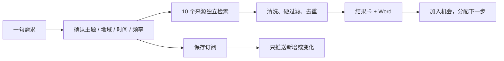
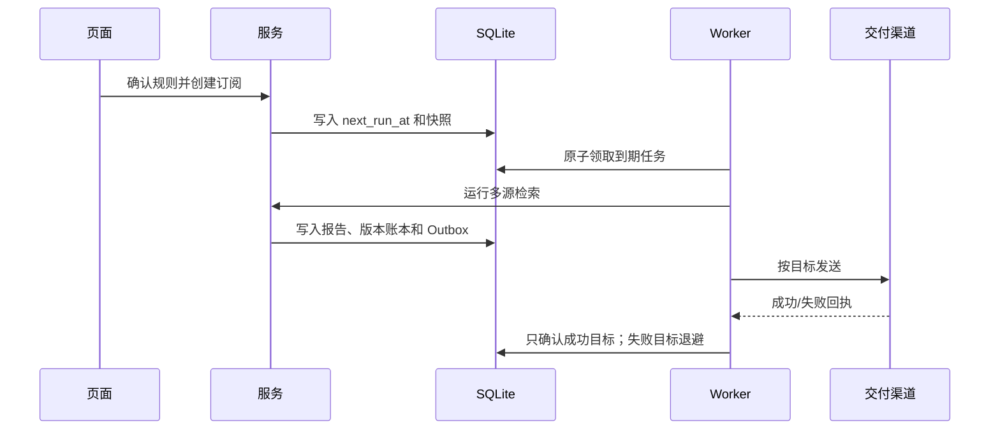
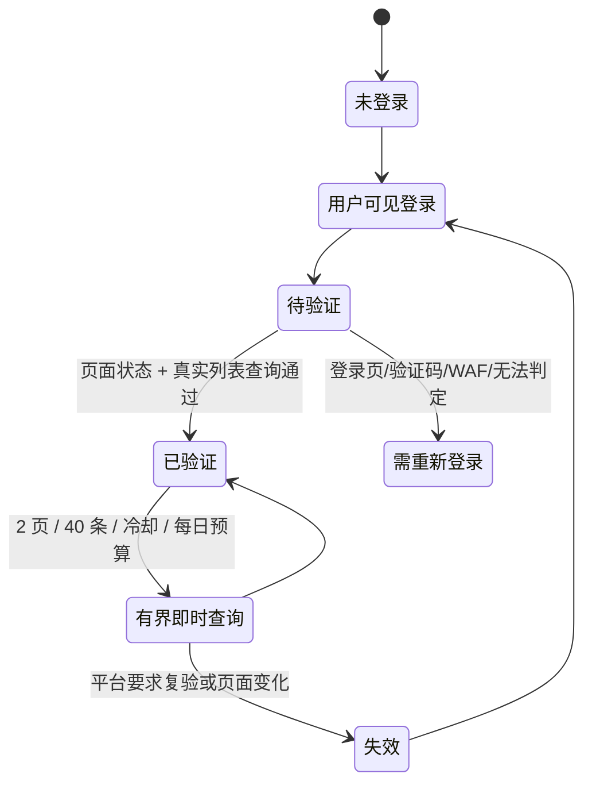
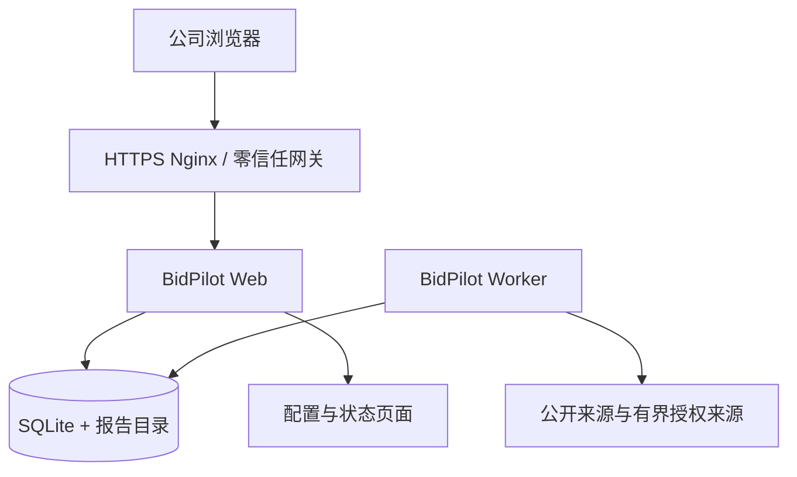

# 标擎 BidPilot：把分散公告变成能跟进的项目

超聚变“招投标信息聚合工具”命题｜团队：聚标成擎｜版本：v0.8.0｜材料更新：2026-08-11

## 一、参赛方案信息

| 项目 | 内容 |
|---|---|
| 命题企业 | 超聚变 |
| 团队 | 聚标成擎 |
| 作品名称 | 标擎 BidPilot：一句话查标讯，原文能复核，订阅只发新内容 |
| 一句话价值 | 给情报专员一句需求，系统先确认口径，再从多个公告站点找回原文、生成 Word，并把值得跟进的项目交给负责人 |
| 成员分工 | 成员 1：产品与技术负责人，负责产品、架构、全栈、检索、测试、部署和最终集成；成员 2：审计与合规负责人，参与授权矩阵、证据抽查、指标口径和交付清单复核。真实姓名以报名表为准 |
| 飞书相关能力 | 支持飞书机器人/应用交付 Word；Demo 录制后可使用飞书妙记做转写、章节和可检索回看。消息投递不冒充 AI 能力 |
| 源码入口 | https://github.com/gitchw/bidpilot |
| Demo | 真实录制、上传并用未登录窗口验证后回填，不提供虚构链接 |

## 二、方案成果展示

### 1. 先看一个人的一天

这是一家服务器解决方案团队的上午九点。情报专员收到一句话：

> 最近一年广东省服务器招标信息，优先看还在招标或更正阶段的项目。

过去，他要在政府采购网、公共资源交易平台、地方站点和商业聚合站之间反复切换，再把链接贴进群里。一个项目的更正公告、中标公告和转载还可能被当成四个项目。真正交给销售同事时，最关键的三件事反而没有答案：原文在哪里、现在走到哪一步、下一步谁来核验。

BidPilot 把这段工作压成一条可复核的路径：输入问题 → 确认口径 → 多源查找 → 筛选和去重 → Word → 机会跟进。它不替人承诺中标，也不把一段生成式摘要当作事实；每一条结论都能回到来源、证据和本轮运行。

### 2. 作品交付什么

| 评委要验证的事情 | 现场看到的交付 |
|---|---|
| 复杂问题能不能说清楚 | 页面展示主题、地域、日期、公告类型、排除词和计划；用户确认后才执行 |
| 结果是不是来自多个来源 | 来源状态页面和运行结果逐源显示扫描、候选、保留、跳过、失败及覆盖缺口 |
| 登录来源有没有说真话 | 千里马显示“未登录 / 待验证 / 已验证 / 需重新登录”，结果标明公开或免费会员列表可见 |
| 结果能不能继续使用 | Word 保留标题、发布时间、来源名称、原文链接、核心内容和附件状态；非零报告逐条可回到原文 |
| 定时任务会不会重复骚扰 | SQLite 账本按公告版本 × 交付目标记账；第二轮只发新增或变化，单个渠道失败可单独重试 |
| 系统是否能长期放在服务器 | Windows、macOS、Linux 启动路径统一；Linux 提供 systemd Web/worker 与企业 HTTPS 拓扑 |

### 3. 三个设计选择

#### 3.1 先确认口径，再动手查

用户不需要学习查询语法，但必须能看到系统究竟理解了什么。规则引擎先解析主题、同义词、地域、时间、公告类型和频率；低置信或冲突时，才让可选模型提出严格 JSON。页面明确展示修正理由，用户确认快照后才创建运行或订阅。

即时问题的主按钮写“开始查找”；每天、每周、每月问题自动改为“创建定时订阅”。一次性预约仍走明确的订阅确认，不让按钮文案掩盖实际能力。

#### 3.2 结论必须回到原文

系统把事实字段锁在结构化记录：标题、日期、采购人、公告阶段、原文 URL、附件 URL 和版本身份不由模型填写。摘要默认抽取式；启用模型时，它只能从本轮固定证据中选择和改写，越界就回退。

结果卡先显示标题、发布时间、采购人、阶段、访问范围和机会分；打开原文、查看证据和适配解释是同一张卡上的动作。Word 与页面共用同一批记录，零结果也保留扫描漏斗，不用无关项目把报告填满。

#### 3.3 结果必须交给下一位责任人

“找到”不是业务终点。用户可以把真实标讯加入机会卡，填写阶段、负责人、下一步动作、计划时间、标签和备注。后续更正、中标或合同事件进入原公告时间线并标为未读，不覆盖人的跟进判断。买方雷达只统计本机已经保存的公告，不把局部样本冒充全市场。

### 4. 产品工作流

#### 4.1 检索与筛选

每个来源适配器返回统一诊断：来源、状态、开始时间、耗时、扫描数、候选数、保留数和淘汰原因。日期、地域、公告阶段和排除词先硬过滤，主题召回和可选语义复核随后进行，跨站相同公告按 `canonical_id` 合并，同一项目的不同阶段按 `project_key` 聚合。

这使“0 条”变得可解释：是所有来源都没有，还是某个来源超时、登录失效，还是候选在地域或公告阶段被排除，页面和 Word 会区分显示。

#### 4.2 Word 交付

每份报告按 `{用户问题}_{时间}.docx` 命名。非零报告逐条包含：标题、发布时间、地域、采购单位、公告类型、核心内容、来源名称与链接、附件名称与链接、证据片段和跨站合并数量。原文没有附件时写“原文未发现可公开下载附件”。

零结果报告不虚构结果，而是写明：本轮扫描了哪些来源、进入候选多少、各原因排除了多少、哪些来源被跳过或需要登录，以及用户可主动确认的放宽建议。定时报告单独标出“全量/增量”和本轮新增数。

#### 4.3 订阅与仅新增

订阅不是浏览器定时器。worker 通过租约领取任务，运行中续租，重启后接管过期租约。账本按“公告版本 × 目标”保存成功确认；同一版本已成功的目标不会再次发送。飞书成功、邮件失败时只重试邮件，超过上限进入死信。

### 5. 免费登录来源：把边界说清楚

千里马的适配目标是“用户本人免费账号原本可见的列表”，不是付费内容，也不是权限绕过。

首次登录在运行 BidPilot 的主机上由用户亲自完成，系统保存专用持久浏览器 profile；不导出 Cookie，不通过 HTTP 重放，不点击付费详情。每次查询仍检查真实页面状态；失效时该来源降级，公开来源继续工作，并在结果中写出覆盖缺口。

Linux 无图形桌面只复用同一服务器上已经完成验证的 profile 做有界 headless 查询；首次登录和失效复验需要可见图形会话。会员监控默认关闭，只有部署方持有书面授权或官方 API 权利并登记授权编号后才能开启。

### 6. 工程与部署

- Windows、macOS、Linux 使用同一 Python CLI；`bootstrap.py` 只依赖标准库准备环境。
- Linux systemd 使用非特权用户、`UMask=0077`、私有临时目录和独立 Web/worker 单元；服务重启后从 SQLite 继续。
- 企业模式只让网关发布 443，后端 8000 留在内部网络。精确 HTTPS Origin、受信客户端网段、受信代理和管理员令牌必须同时满足。
- Compose 与 systemd 的浏览器运行时、数据卷和登录 profile 要分别验收；不把一套环境的结果写成另一套环境的证明。

### 7. 真实运行与验收方法

交付包会放入多份不同问题的运行结果 Word：正向结果、自然零结果、公开来源结果，以及千里马免费登录验证后参与检索但被地域条件排除的诊断记录。当前样例没有把未通过过滤的千里马列表项包装成最终结果；所有材料只使用仓库当前版本的真实运行记录，不会把预录画面或硬编码列表当作在线成功。

2026-08-11 的隔离订阅核验使用同一个“广东服务器”任务连续运行两次：首轮真实检索保留 57 条并生成 Word，版本账本写入 57 条；第二轮再次检索到相同 57 条，本轮新增为 0，系统没有生成空 Word，而是在运行记录和 Outbox 中写明“本轮无新增、按策略跳过”，账本仍为 57 条。交付包同时保留两轮 ID、数据库快照、正式 API 回读和 SHA-256，可独立核验这不是口头描述。

评审可随机抽查五件事：

1. 页面里的标题、日期、来源和 Word 是否一致；
2. 点开来源链接能否回到原文，附件缺失是否诚实标注；
3. 一个来源失败时，其他来源结果是否仍保留；
4. 第二次订阅运行是否只产生新增或变化；
5. 千里马会话失效时是否明确降级，而不是显示“已验证”。

评价分五层：来源可用性、情报可信度、检索质量、工程可靠性和业务采用。前四层由页面、Word、测试、日志和部署脚本提供证据；耗时节省、覆盖率和机会转化是第 0 周冻结基线后再做的 4 周试点指标，不在比赛材料里冒充客户业绩。

## 三、团队协作与自由展示

### 8. 团队协作

产品与技术负责人承担命题拆解、架构、来源适配、AI/检索、前后端、测试、部署、文档和演示。审计与合规负责人参与来源授权边界、证据样本抽查、字段口径、指标定义和交付清单复核。每个角色都有可交付的检查记录，不把“参与”写成不真实的核心研发主导。

### 9. 当前边界与后续路线

当前版本是单租户、单主机或企业内网部署；没有多租户 RBAC、SSO、原生移动 App、机会追加式操作日志或分布式数据库。真实来源会受站点结构、频率、验证码和授权变化影响，系统承诺如实显示降级，不承诺“覆盖全部公告”或“永不失效”。

后续优先级是：统一跨页面证据主键、追加式机会活动日志、订阅覆盖体检、字段级截止时间/预算抽取，以及在真实试点后确定业务阈值。

### 10. 复现入口

- `README.md`：安装、启动、网络模式与来源边界；
- `docs/LINUX_DEPLOYMENT.md`：Linux systemd 与企业 HTTPS；
- `docs/COMPETITION_DEMO_SCRIPT.md`：多个问题的录制分镜；
- `docs/DELIVERY_CHECKLIST.md`：按命题要求逐项验收；
- `/docs`：当前运行实例的中文 API 说明。
