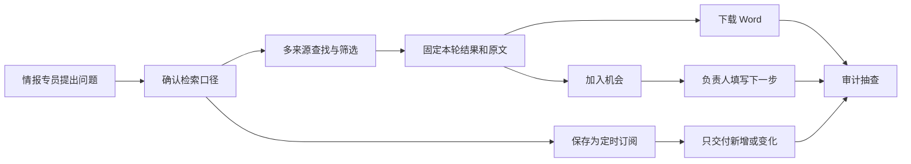
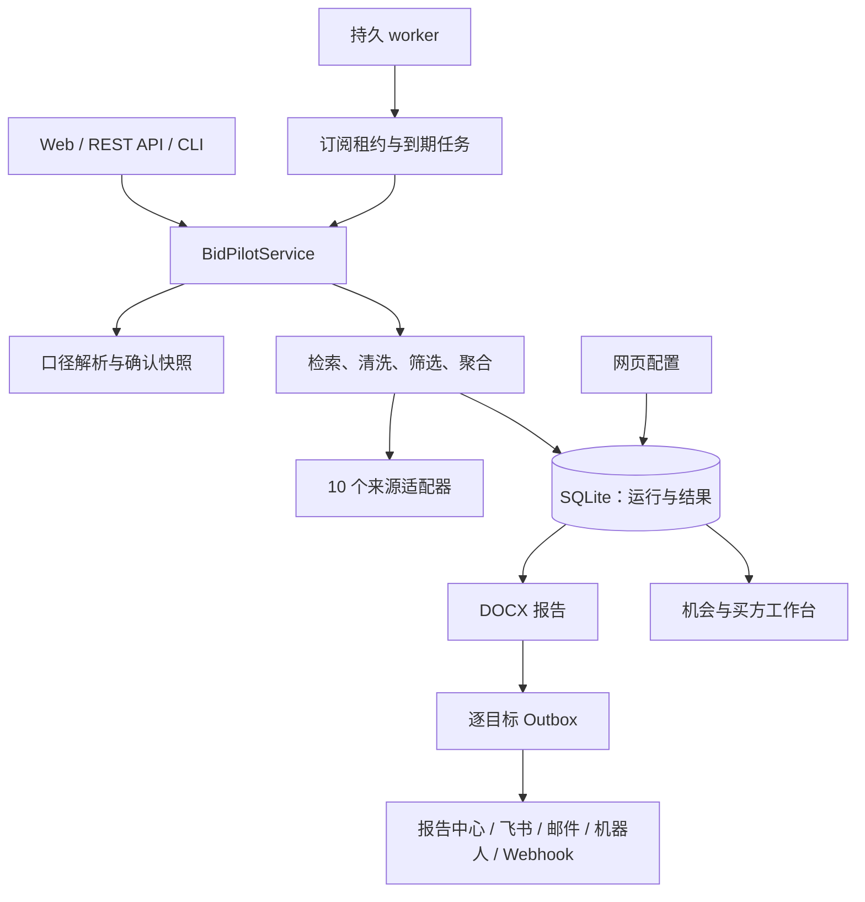
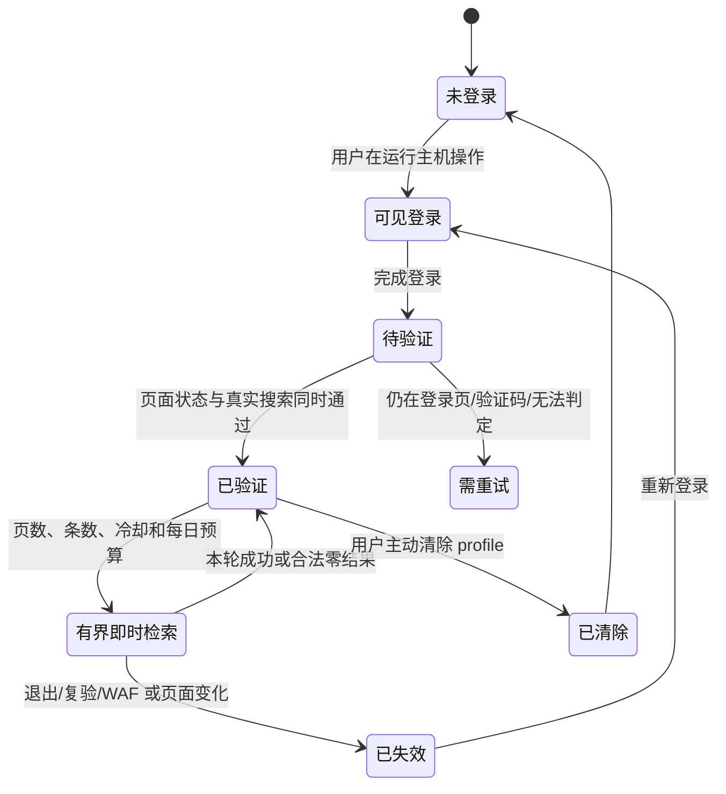
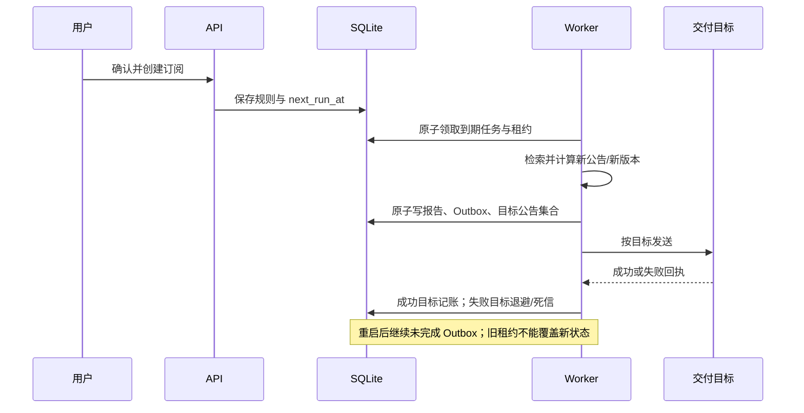

# 标擎 BidPilot 详细设计说明书

文档版本：v0.8.0｜更新时间：2026-08-11｜团队：聚标成擎

## 1. 这份文档回答什么

本文不从技术名词开始，而是回答四个可以现场验收的问题：

1. 用户的一句话怎样变成确定的主题、地域、时间和执行频率；
2. 每条结果怎样回到公告原文、附件和本轮处理记录；
3. 定时任务怎样只交付新增或发生变化的公告版本；
4. 服务怎样在 Windows、macOS 和 Linux 上启动，并在 Linux 重启后继续运行。

BidPilot 的主用户是一家服务器解决方案团队的招投标情报专员。销售和投标人员接手值得跟进的项目，审计与合规人员抽查来源、权限和交付口径。系统最终交付的不是一堆链接，而是一份能继续行动的名单：项目是什么、是否仍值得关注、原文和附件在哪里、谁负责下一步。

## 2. 命题要求与实现位置

| 命题要求 | 产品中的实现 | 验收信号 |
|---|---|---|
| 识别主题、区域、时间、频率 | 自然语言解析后展示检索口径；用户确认后执行 | 页面和 Word 同时显示主题、地域、起止日期、计划 |
| 至少两个来源 | 当前接入 10 个来源适配器，各自返回运行诊断 | 一次运行可查看每个来源的扫描、候选、保留和状态 |
| 至少一个免费登录来源 | 千里马使用用户本人完成的持久浏览器登录 | 来源状态显示最近验证；结果标明免费会员可见范围 |
| 清洗、筛选、去重 | 正文清洗、日期/地域/类型/排除词硬过滤、跨站与生命周期聚合 | 零结果有淘汰漏斗；重复记录有合并数量和时间线 |
| Word 结果 | 每轮生成 DOCX，包含标题、发布时间、来源、核心内容和附件状态 | 非零报告逐条可打开原文；零结果报告保留覆盖诊断 |
| 定时与仅新增 | SQLite 订阅、worker 租约、公告版本账本、逐目标投递账本 | 第二轮不重发已确认版本；更正/中标作为新事件继续交付 |

## 3. 一次真实工作的对象与责任

关键责任划分如下：

- 情报专员确认“查什么”和“多久查一次”；系统不能在口径未确认时自行扩大范围。
- 程序负责日期、地域、公告类型、排除词和版本账本等确定性判断。
- 模型只在启用时建议同义词、复核边缘候选、生成受证据约束的摘要和适配解释；它不能改写 URL、公告身份、日期或金额。
- 销售或投标人员维护负责人、阶段、下一步和计划时间；后续公告不会覆盖人的跟进字段。
- 审计同事维护来源授权矩阵、样本抽查表和发布清单，不替代产品与工程负责人作技术实现声明。

## 4. 总体架构

Web 进程处理交互和 API；worker 领取长期任务与外发队列。两者共享 SQLite 和报告目录。开发环境可以由 Web 内嵌 worker 开箱运行；生产环境使用两个独立进程，避免页面请求承担长期任务生命周期。

## 5. 核心领域对象

| 对象 | 稳定标识与状态 | 责任与不可越过的边界 |
|---|---|---|
| `TenderQuerySpec` | 原问题、主题、地域、日期、`Schedule`、确认快照 | 用户确认后的运行口径；快照绑定原问题并限时有效 |
| `Run` | `run_id`、状态、来源诊断、报告路径 | 一次输入到输出的审计边界；失败来源不能抹掉成功来源 |
| `TenderRecord` | `canonical_id`、`version_hash`、`project_key` | 固定标题、日期、来源、附件和摘要证据；浏览器不能自造记录 |
| `Subscription` | `id`、`next_run_at`、租约、重试状态 | 保存长期任务；进程重启后可恢复，不依赖系统计划任务 |
| `DeliveryOutbox` | 运行 × 目标 × 公告版本集合 | 每个目标单独发送、确认和重试；成功目标不会随失败目标重发 |
| `Opportunity` | 项目键、阶段、负责人、下一步、计划时间 | 只引用已保存标讯；公告更新不覆盖人工跟进字段 |
| `SourceAuthorization` | 来源、状态、验证时间、失效原因 | 不保存密码；凭据和浏览器 profile 不进入 Git 或交付 ZIP |

`canonical_id` 用于公告级去重，`version_hash` 区分同一公告内容变化，`project_key` 把招标、更正、中标和合同等事件归为同一项目。三者用途不同，不能为了减少字段而合并。

## 6. 从输入到结果

### 6.1 先确认口径

规则解析先识别常见时间、行政区和频率。只有字段缺失、冲突或低置信时，才调用可选模型提出严格 JSON 修正；所有修正逐字段校验。解析完成后，页面摊开主题、地域、日期和计划。

主按钮按计划类型分流：

- 即时问题进入 `/api/v1/runs`；
- 每日、每周、每月问题进入持久订阅；
- 一次性预约仍通过明确的订阅入口确认，不用尚未验证的前端捷径冒充已完成能力。

### 6.2 有界检索

每个来源只接收规范化口径和查询预算。来源适配器独立执行并返回：状态、实际扫描数、进入候选数、保留数、淘汰原因和说明。单源失败不会把整轮标为“全网无结果”。

筛选顺序保持稳定：

1. 日期、地域、公告阶段与排除词硬过滤；
2. 主题与同义词召回；
3. 可选语义复核只处理边缘候选；
4. 公告去重和项目生命周期聚合；
5. 抽取摘要、机会分和交付字段。

### 6.3 结果先服务行动

完成页先回答四件事：是否完成、找到多少、覆盖是否受限、Word 在哪里。随后展示结果卡和“加入机会”；检索轨迹、模型状态和淘汰理由放到后续详情。零结果不是一句“没有”，而是保留扫描漏斗、来源缺口和可由用户主动采用的放宽建议。

## 7. 事实与模型的边界

BidPilot 使用“程序锁事实、模型选证据”的分工。

- 标题、发布时间、采购单位、公告阶段、来源 URL、附件 URL 和记录身份来自抓取与结构化记录。
- 摘要默认采用抽取式文本；启用模型时，输出必须能映射回本轮证据，否则整条摘要回退。
- 适配判断先经过企业排除条件，再允许模型选择相关画像词和逐字引句；分数与推荐由本地程序计算。
- 本轮追问只能选择已存在的 E 编号和允许字段；不存在的编号、改写后的 URL 或凭空增加的数字会被拒绝。

当前不同页面中的 E 编号由各自的本轮证据目录生成。后续版本将把 `evidence_id` 在运行入库时一次生成并持久化；在此之前，验收以 `canonical_id + version_hash` 的记录身份一致性为准，不把 E 编号宣传成跨模块永久主键。

## 8. 千里马免费账号会话

目标不是绕过登录，而是在用户本人账号原本可见的范围内，让服务器能安全复用一次已验证会话。

实现边界：

- 登录由用户在运行 BidPilot 的主机上完成；系统不接收或记录密码。
- 千里马复用专用持久浏览器 profile，不导出 Cookie，也不通过 HTTP 重放冒充浏览器会话。
- 每次查询仍检查原站真实登录状态；验证码、WAF、权限不足或 DOM 变化会产生明确诊断。
- 默认最多 2 页、40 条，具有冷却和每日预算；不点击付费详情。
- 长期会员监控默认关闭。只有部署方持有书面授权或官方 API 权利并登记编号后才允许开启；开关本身不构成授权。
- profile、数据库、密钥和用量账本属于部署数据，不进入 Git、截图、源码 ZIP 或比赛附件。

Linux 无图形桌面时可以复用已经在同一服务器上完成并验证的 profile 进行有界无头检索；首次登录和失效复验仍需要可见图形会话。容器是否包含浏览器运行时必须单独验收，不能用 systemd 的能力替代容器证明。

## 9. 定时、增量与逐目标投递

增量键由公告规范身份和内容版本组成。订阅第二次运行时，旧版本已经被目标成功确认就不再发送；同一项目出现更正、中标或合同事件时，因为版本或生命周期事件发生变化，会作为新内容继续交付。

当前版本已完成一组隔离的双轮实跑：同一订阅首轮保留并交付 57 条，账本形成 57 个目标版本确认；第二轮仍检索到 57 条，但 `new_count=0`、`report_path=null`，本地目标 Outbox 为 `skipped`，账本数量不增长。审计目录保留两轮运行 ID、订阅 ID、数据库快照、正式 API 回读和完整性清单；第二轮不额外制造一份“0 条增量 Word”，以免把无新增回执误装成新的业务结果。

投递使用“至少一次 + 成功后防重”语义。外部平台已收到、但本地在确认前崩溃的极小窗口仍可能重复，系统不宣称端到端绝对恰好一次。飞书成功而邮件失败时，只重试邮件；五次失败进入可见死信，管理员可在修复配置后单独重新排队。

## 10. Word 报告契约

非零报告至少包含：

- 用户原问题和确认后的检索口径；
- 本轮运行时间、结果数量和来源覆盖；
- 每条公告的标题、发布时间、采购单位、阶段、核心内容；
- 来源名称、原文链接、附件名称与附件链接；原文未提供附件时明确写“未发现附件”；
- 证据片段、重复合并数量和可用诊断。

零结果报告不伪造项目，而是输出来源状态、扫描漏斗、淘汰原因和覆盖缺口。定时报告还标明“全量/增量”和本轮新增数。文件名使用安全化用户问题与时间戳，符合 `{用户问题}_{时间}.docx` 的提交规则。

## 11. 机会跟进与买方观察

机会只能从数据库已有标讯创建。卡片保存阶段、负责人、下一步执行动作、计划时间、标签、备注和已读状态。项目出现后续公告时，证据时间线更新并标记未读，但人的跟进字段保持原值。

买方雷达只聚合本机已经保存的公告，不联网猜联系人，也不把局部样本称作全市场。采购单位识别缺失会作为覆盖率显示；从买方卡创建监控时，规则继续经过口径确认和订阅流程。

当前机会表保存最新人工状态，尚未提供字段级追加式操作日志。因此本版可复核公告生命周期和当前跟进责任，但不能宣称已经具备完整多人操作审计；活动日志与角色权限列入后续版本。

## 12. 部署与网络边界

| 模式 | 适用场景 | 约束 |
|---|---|---|
| `local` | 单机或比赛演示 | 默认监听 `127.0.0.1`；无需远程身份体系 |
| `lan` | 临时可信局域网 | 管理员令牌或明确可信私网策略；普通 HTTP 不得映射公网 |
| `enterprise` | 公司 Linux 服务器 | HTTPS 网关、私有客户端网段、可信代理、精确 Origin、管理员令牌同时成立 |

企业模式只发布 Nginx 443，Web 的 8000 端口留在内部网络。所有业务 API（包括读取）要求管理员令牌，代理头只接受配置的可信代理。systemd 使用专用非特权用户、只读系统、私有临时目录和最小写目录；Web 与 worker 均设置自动重启。

SQLite 适合当前单租户、单主机部署。数据目录和报告目录必须纳入停服备份；恢复演练要同时验证数据库、报告、密钥和浏览器 profile 的所有权。多租户、SSO/RBAC 和数据库集群不属于本次已交付范围。

## 13. 五层评价与取证

评价不先写一个好看的“准确率”，而是让评委和试点用户复核过程。

| 层级 | 现场或试点指标 | 证据与口径 |
|---|---|---|
| 来源可用性 | 来源状态准确、覆盖缺口披露、登录失效不冒充成功 | 来源状态页面、每轮诊断、人工打开原站抽查 |
| 情报可信度 | 标题/日期/来源一致，无证据补写为 0 | 页面、Word、原文三方逐条核对 |
| 检索质量 | 硬条件误保留、重复合并、零结果可解释 | 冻结问题集与人工判定表，不用演示数据冒充客户基线 |
| 工程可靠性 | 跨平台测试、重启恢复、单源隔离、逐目标重试 | CI、故障注入、worker 与 Outbox 日志 |
| 业务采用 | 首次检索耗时、有效机会确认、跟进动作完成 | 第 0 周冻结人工基线，第 1–4 周同口径对照 |

前四层可以在交付环境复核。业务节省时间、覆盖率和机会转化必须等真实试点后计算，当前材料不把建议阈值写成既有客户成绩。

## 14. 故障与恢复

- 单个来源超时：保留其他来源结果，并将该源标为部分覆盖或失败。
- 登录失效：停止会员增强，公开来源继续运行；提示重新登录，不复用旧缓存伪装在线。
- 模型不可用或输出越界：回退规则解析、抽取摘要或本地适配判断。
- worker 中断：过期租约由新 worker 接管，运行记录和 Outbox 不丢失。
- 渠道临时失败：按平台提示或有限退避重试；成功目标不重发。
- 配置或网络错误：页面保留明确错误和恢复入口；敏感值不回显到日志。

## 15. 团队分工与发布控制

产品与技术负责人负责命题拆解、信息架构、前后端、来源适配、调度、测试、部署和最终集成。审计与合规负责人参与来源授权矩阵、证据样本抽查、指标口径、Word 字段和提交清单复核。这样的表述既体现协作，也不夸大任何成员的研发贡献。

发布前必须完成：完整测试与静态检查、三个桌面系统 CI、Linux/容器配置检查、私密文件扫描、非零和零结果 Word 抽查、至少一份真实增量样例、所有 DOCX 分页渲染检查，以及最终 Git 提交与源码 ZIP 一致性核验。

## 16. 明确未完成或不承诺的事项

- Demo 公开视频需要在真实录制并设置公开可读后由团队回填，构建脚本不会生成虚假链接。
- 当前没有多租户 RBAC、SSO、移动原生 App、机会操作活动日志或分布式数据库。
- 真实网站可能因结构、频率、验证码和授权变化而退化；系统承诺如实显示状态，不承诺“覆盖全部公告”或“永不失效”。
- 业务效率和转化数据属于 4 周试点评价，不是当前客户业绩。

## 17. 参考与复现入口

- `README.md`：跨平台安装、启动和运行边界；
- `docs/LINUX_DEPLOYMENT.md`：Linux、systemd、企业网络和登录来源运维；
- `docs/CROSS_PLATFORM_TEST_AUDIT.md`：本次发布的测试与平台证据；
- `docs/COMPETITION_DEMO_SCRIPT.md`：多个问题从输入到输出的录制脚本；
- `/docs` 与 `/openapi.json`：运行实例中的接口说明。
