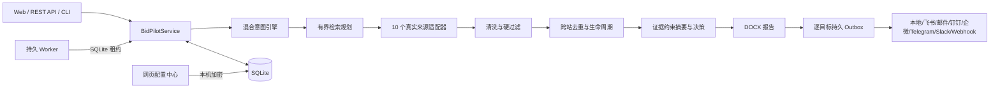

# 标擎 BidPilot 详细设计文档

文档版本：v0.8.0（竞赛交付版）
更新时间：2026-08-02
团队：聚标成擎
命题方：超聚变

## 1. 文档目的

本文描述标擎 BidPilot 的需求边界、总体架构、模块设计、数据结构、外部来源、授权机制、调度与投递、安全控制、部署方式和验收方法。评审或接手人员可依据本文，从自然语言问题开始，复现“解析—检索—证据过滤—去重—Word 报告—增量投递”的完整业务闭环。

## 2. 建设目标与非目标

### 2.1 建设目标

1. 将中文自然语言编译为主题、地域、时间范围、公告类型、排除词、执行计划和投递目标。
2. 从不少于两个真实来源检索招投标信息，并保留来源 URL、发布时间、事实核心内容和附件地址。
3. 对用户本人已获授权的免费会员内容提供受控增强，不伪造登录成功，不突破付费、角色、验证码、CA 或频率边界。
4. 清理导航、广告和模板噪声，执行时间、地域、公告类型和排除词硬过滤。
5. 对跨站转载和同项目多阶段公告进行去重与生命周期聚合。
6. 支持即时、每日、每周、每月和一次性任务，只投递相对于对应目标的新内容。
7. 生成命名为“用户问题_时间.docx”的可审计 Word 报告，并支持多目标可靠投递。

### 2.2 明确非目标

- 不绕过登录、验证码、WAF、CA、付费墙、角色权限或站点频率限制。
- 不把模型输出当作公告事实，不生成虚构标题、采购人、日期、金额、附件或 URL。
- 不宣称外部网络投递具备分布式绝对恰好一次语义。
- 不直接向公网暴露没有独立身份认证的本地管理界面。

## 3. 竞赛需求映射

| 命题要求 | 设计实现 | 验收证据 |
|---|---|---|
| API、CLI 或 Web UI | FastAPI、Typer CLI、中文 Web UI 三入口 | `/docs`、`python -m bidpilot --help`、首页 |
| 自然语言输入 | rules-v2 基线 + 可选 LLM 严格 JSON 修正 | 意图确认卡与字段级轨迹 |
| 至少两个来源 | 10 个真实适配器，来源独立诊断 | 来源中心和运行诊断 |
| 至少一个登录来源 | 中国招标投标网会话经真实搜索与免费会员详情验证；千里马另提供用户可见登录、持久配置和 Linux 后台有界复用 | 授权状态、真实会员报告、自动化回归 |
| 清洗噪声 | DOM 定向抽取、正文清洗、附件提取 | 报告正文与来源适配器测试 |
| 跨站去重与过滤 | 稳定哈希、主题/地域/时间/类型硬过滤、生命周期聚类 | 诊断漏斗和去重字段 |
| 日/周调度与只发新增 | SQLite worker、租约、版本账本和逐目标 Outbox | 订阅历史、投递回执、重启测试 |
| Word 结果字段 | 标题、时间、来源 URL、事实摘要、附件 URL | `outputs/reports/*.docx` |

## 4. 总体架构

系统以 `BidPilotService` 为应用编排中心。Web、CLI 和 worker 调用同一业务服务，避免不同入口产生不同规则。SQLite 同时保存业务数据、调度状态、来源诊断、授权元数据、运行结果和投递账本。

## 5. 代码模块

| 模块 | 主要职责 |
|---|---|
| `bidpilot/intent.py`、`hybrid_intent.py` | 中文规则解析、可选模型修正、字段级锁定与确认快照 |
| `bidpilot/retrieval.py` | 本地同义词/行业词扩展、模型检索建议校验、二轮有界补搜、语义边界复核 |
| `bidpilot/sources/` | 10 个来源的搜索、详情、附件、地域路由和覆盖诊断 |
| `bidpilot/source_auth.py` | 可见浏览器授权、状态机、真实验证、清除与安全边界 |
| `bidpilot/pipeline.py` | 多来源并发、硬过滤、去重、生命周期聚类和来源漏斗 |
| `bidpilot/intelligence.py`、`decision.py` | 证据约束情报简报、企业适配与确定性降级 |
| `bidpilot/report.py` | Word 报告与零结果诊断报告 |
| `bidpilot/scheduler.py`、`service.py` | 订阅、worker 租约、增量账本、运行编排 |
| `bidpilot/delivery.py` | 多目标投递、重试、死信、平台回执和脱敏错误 |
| `bidpilot/api.py`、`static/`、`cli.py` | REST、中文 Web UI 与 CLI |
| `bidpilot/db.py` | SQLite 建表、迁移、事务与持久化访问 |

## 6. 自然语言与 AI 设计

### 6.1 确定性基线

`rules-v2` 优先识别主题、关键词、地域、时间、公告类型、排除词、计划和交付目标。所有日期均转换为明确起止时间；地域映射到标准省市；普通“招标信息/采购信息”不会误收窄为单一公告类型。

### 6.2 模型参与边界

当字段缺失、冲突或置信度不足时，系统才向 OpenAI-compatible 模型发送必要文本。模型只能返回严格 JSON 建议；本地再次校验字段类型、取值、日期、地域和用户锁定值。模型不可生成公告事实或扩大硬过滤边界。

### 6.3 检索与语义复核

检索规划把“可信相关词”和“只用于发现的模型词”分开。时间、地域、公告类型和排除词永远由本地执行。边界候选允许模型复核，但必须引用候选中逐字存在的证据片段并选择本地可信概念，否则拒绝。

## 7. 来源设计

| 来源 | 接入模式 | 主要边界 |
|---|---|---|
| 中国招标投标网 | 关键词搜索 + 可验证免费会员详情 | 仅允许域名；搜索与详情同时验证后启用 |
| 中国政府采购网 | 官方公开列表/详情 | 正文与附件；近期列表覆盖 |
| 全国公共资源交易平台 | 官方最新公告流 | 不冒充全量历史检索 |
| 商务部中国国际招标网 | 官方关键词接口 | 公告与详情 |
| 千里马招标网 | 公开分类 + 用户持久浏览器免费会员首屏 | 首次可见登录；已验证配置可在 Linux 后台无头复用；仅即时、单次、首屏，无 Cookie 导出、无定时、无付费详情 |
| 中国招标投标公共服务平台 | 公开关键词列表 | 不突破详情 WAF 或会员门禁 |
| 中央政府采购网 | 官方关键词接口 | 列表摘要，诚实标注部分覆盖 |
| 军队采购网 | 官方公开采购大厅 | 不进入 CA/角色工作台 |
| 广东省政府采购网 | 省级全文接口 | 21 地市路由、正文、附件 |
| 深圳公共资源交易中心 | 地域关键词接口 | 深圳路由、分页、详情、日期 |

每个适配器返回统一 `SourceSearchResult`，其中包含状态、候选、扫描数、预过滤原因、耗时和中文诊断。单个来源失败不会使整次运行失败。

## 8. 登录态设计

### 8.1 中国招标投标网

用户在服务主机的可见浏览器亲自登录。系统只提取允许域名 Cookie，以本机 Fernet 密钥加密保存；捕获后状态为 `captured_unverified`。真实搜索和至少一条账号原本可见的免费会员详情同时解锁，状态才变为 `authorized`，信任期最长 7 天。失败、无法判定和过期状态不会进入后台增强检索。

### 8.2 千里马免费登录

千里马采用不同机制：Playwright 使用独立持久 Chromium 配置目录 `data/browser_profiles/qianlima/`。首次登录强制由用户本人在可见图形会话扫码或输入账号；系统不导出 Cookie，也不把 Cookie 交给 HTTP 客户端。验证通过后，桌面任务默认继续可见；Linux systemd 无 `DISPLAY/WAYLAND_DISPLAY` 时，`auto` 模式可仅在持久浏览器内部复用已经验证的配置执行一次首屏无头检索。

验证与运行约束由代码强制：

1. 只允许 `immediate` 即时任务调用会员浏览器；每日、每周、每月和一次性后台计划继续使用公开分类流。
2. 每次只向原站提交一个用户主题，读取当前首屏最多 20 条列表摘要。
3. 不自动翻页，不点击详情，不下载附件，不读取付费内容。
4. 10 秒冷却期阻止同进程连续查询；页面要求重新登录时立即返回 `auth_required`。
5. 清除授权会删除本地浏览器配置目录；仓库忽略该目录。

该设计遵循千里马会员注册须知第 6-7 条，不实施非人为连续、频繁查询或不合理大批量抓取。若需定时会员检索、批量翻页或详情抓取，应先取得千里马书面授权或官方 API。

## 9. 证据清洗、过滤与去重

列表页只负责召回候选；详情页或可见列表提供事实证据。清洗器删除脚本、样式、导航、广告和重复空白，保留正文、项目编号、采购人、发布时间、地域和附件。硬过滤顺序为日期、地域、公告类型、排除词、主题。每次排除均计入诊断。

去重采用规范化标题、项目编号、采购人、地域和来源 URL 的稳定哈希。跨站同项目公告聚为一个项目生命周期；更正、中标、合同等后续事件保留版本并更新机会卡片，不把不同阶段简单删除。

## 10. 报告与数据模型

核心模型包括：

- `TenderQuerySpec`：用户意图及签名确认快照。
- `RawTender`：来源原始候选、正文、附件、证据与授权级别。
- `TenderRecord`：清洗、过滤、去重后的规范记录和评分。
- `RunResult`：运行状态、来源诊断、检索轨迹、结果和报告路径。
- `Subscription`：长期规则、下次执行时间、投递策略和目标。
- `DeliveryOutbox`：逐目标状态、重试、回执与死信。

Word 报告文件名来自清洗后的用户问题和北京时间戳。报告包含查询口径、运行时间、来源覆盖、扫描/候选/保留漏斗、标题、发布时间、来源 URL、事实摘要、附件 URL 和授权级别。零结果仍生成诊断报告，不伪造内容。

## 11. 调度、增量与投递

worker 通过 SQLite 原子事务领取到期任务并维护租约。运行期间续租，防止多个 worker 重复执行。每个订阅维护版本账本；只有相对于目标尚未成功投递的公告版本进入该目标 Outbox。

报告记录、全部目标 Outbox 和公告集合在外发前原子落库。成功目标与其版本账本同一事务提交；失败目标独立重试。临时错误采用有限退避并尊重平台 `Retry-After`；永久错误或达到上限进入死信，可单目标恢复，不重新抓取、不重发成功目标。

## 12. API 与 Web UI

FastAPI 提供 52 个具备中文用途、参数、返回、副作用和错误说明的 OpenAPI 操作。Web UI 覆盖情报检索、决策中心、机会工作台、订阅中心、来源中心、配置中心和报告历史。CLI 覆盖解析、运行、服务生命周期、来源检查、worker 和 OpenAPI 导出。

来源授权和运行时配置写操作需要短期同源编辑令牌；局域网还受管理员令牌或可信私网策略约束。所有读取接口只返回脱敏状态，不返回 Cookie、密码、Token 或完整 Webhook。

## 13. 安全与隐私

- `.env`、数据库、`data/secrets/`、`data/browser_profiles/`、缓存和报告不进入源码仓库。
- 配置密钥使用本机 Fernet 密钥加密，API 只返回“是否已配置”。
- 授权材料只发送到显式允许的 HTTPS 主机；重定向后再次校验主机。
- 日志和错误会移除 URL Token、Authorization、Cookie、密码和敏感查询参数。
- 服务默认绑定 `127.0.0.1`；LAN 模式不应直接映射公网。
- 模型只接收完成任务所需的有限文本，失败时回退确定性路径。

## 14. 故障处理

| 故障 | 系统行为 |
|---|---|
| 单一来源超时/结构变化 | 标记 failed/partial，保留其他来源结果 |
| 授权失效 | 返回 auth_required，停止会员增强，不冒充成功 |
| 模型不可用/JSON 非法 | 回退本地规则、词典和抽取摘要 |
| 运行中进程退出 | 租约过期后由新 worker 接管 |
| 投递临时失败 | 仅失败目标有限退避重试 |
| 投递永久失败 | 进入死信，等待用户修复并单目标恢复 |
| 零结果 | 生成诊断 Word，显示漏斗、排除原因和安全建议 |

## 15. 部署设计

### 15.1 原生 Python

要求 Python 3.11+。执行 `python bootstrap.py --dev` 创建虚拟环境；随后运行 `.venv\Scripts\python.exe -m bidpilot serve`（Windows）或 `.venv/bin/python -m bidpilot serve`（macOS/Linux）。

### 15.2 Docker Compose

Compose 把 Web 与 worker 分为两个可自动重启的进程，共享 SQLite 数据卷和报告卷。宿主端口由 `.env` 的 `BIDPILOT_PORT` 控制并只发布到 `127.0.0.1`。Compose 模型与 Linux 镜像已在 GitHub Ubuntu runner 实际构建通过。

### 15.3 Linux systemd

仓库提供 `deploy/systemd/bidpilot-web.service`、`bidpilot-worker.service` 和环境样例。两个服务以专用 `bidpilot` 用户运行，使用 `UMask=0077`、`NoNewPrivileges`、`ProtectSystem=strict`、`ProtectHome` 与 `PrivateTmp`，只开放数据与报告写目录。`deploy/systemd/smoke-test.sh` 会真实安装、启动、检查 worker 心跳、优雅停止并清理临时环境。

## 16. 验证策略

自动化测试覆盖意图、来源解析、授权状态机、敏感请求白名单、过滤去重、生命周期、SQLite 迁移、worker 租约、Outbox、投递渠道、API、配置、报告和安全降级。发布门禁还包括 Ruff、Ruff format、`compileall`、JavaScript 语法、JSON/YAML/TOML 解析和 `git diff --check`。

真实网络验收至少保留：

1. 中国招标投标网真实会员搜索与免费会员详情验证结果。
2. 千里马用户持久浏览器免费登录与“服务器”首屏检索结果。
3. 多来源真实 Word 报告和来源诊断。
4. 服务重启后订阅、配置、授权元数据和投递账本恢复。

## 17. 已知限制与后续计划

- 全国公共资源交易平台当前入口只覆盖首页最新流。
- 某些官方站点对详情直链、WAF 或频率有限制，系统会诚实降级。
- 千里马会员检索因原站条款仅支持用户即时首屏；更强自动化需书面授权或官方 API。
- Docker Compose 模型与 Linux 镜像已在 GitHub Ubuntu runner 实测通过；生产网络、证书和身份体系仍需目标环境单独验收。
- 飞书、邮件等真实外发需要用户提供合法凭据并在界面二次确认测试。

后续优先级为：官方 API 合作、来源健康回归、企业内部权限与审计、多租户隔离、业务反馈指标闭环。

## 18. 参考资料

- 超聚变命题页：https://activity.feishu.cn/future-talent?detail=chaojubian
- 千里马会员注册须知：https://center.qianlima.com/register_xz.jsp
- FastAPI：https://fastapi.tiangolo.com/
- Playwright：https://playwright.dev/python/
- Python：https://docs.python.org/3/
- SQLite：https://www.sqlite.org/docs.html
