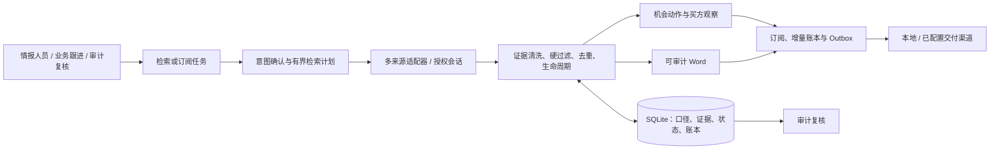
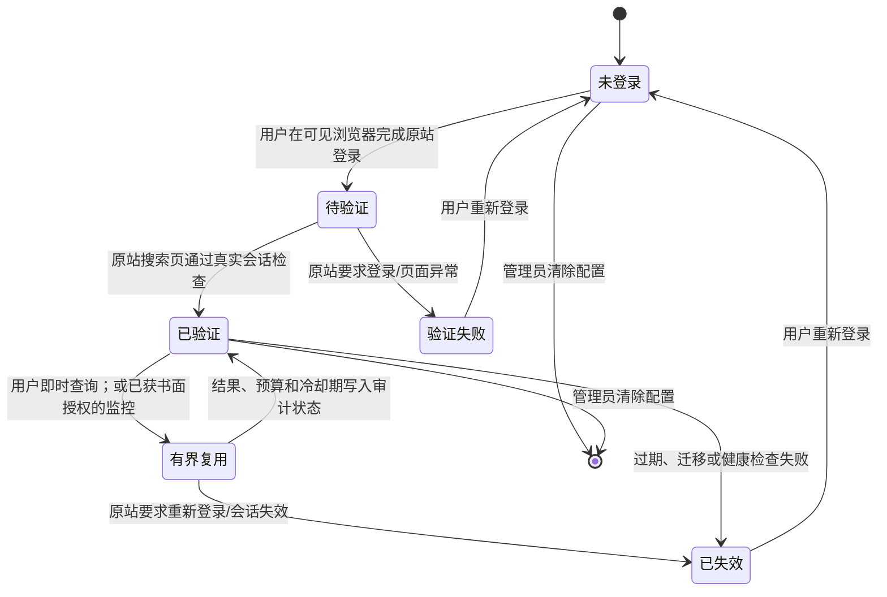

# 标擎 BidPilot 详细设计文档

文档版本：v0.8.0（40 强竞赛增强终版）
更新时间：2026-08-04
团队：聚标成擎
命题方：超聚变

## 1. 文档目的与表述规则

BidPilot 是面向企业采购情报人员、业务跟进人员和审计复核人员的证据驱动工作流：将一句需求转成可确认的检索或订阅任务，取得并固化来源证据，完成硬过滤、生命周期聚合、机会跟进与增量交付。本文说明可复现的设计和边界，不以演示数据替代客户成效。

全文统一使用三种状态，避免把设计、试点指标和已交付能力混为一谈：

| 状态 | 含义 | 写法 |
|---|---|---|
| 已实现 | 能在当前代码、界面、测试或运行记录中复核 | “已实现”“当前支持” |
| 4 周试点目标 | 需要在客户环境、真实任务和基线对照中验证 | “试点目标”“建议验收阈值” |
| 路线图 | 尚未进入当前交付的候选能力 | “后续计划”，不在 Demo 中冒充现有功能 |

## 2. 建设目标、非目标与责任边界

### 2.1 建设目标（已实现）

1. 将中文自然语言解析为主题、地域、时间、公告类型、排除词、计划与投递目标，并允许用户确认口径。
2. 从多个真实来源取得候选，保留来源 URL、发布时间、原始字段/证据片段和附件地址（如原站提供）。
3. 执行时间、地域、类型和排除词硬过滤；将跨站转载及同项目多阶段公告归为可追溯生命周期。
4. 生成可审计 Word 报告；通过 SQLite 任务租约、版本账本和逐目标 Outbox 支持仅新增投递与失败重试。
5. 将已确认的真实标讯加入机会工作台，保存阶段、负责人、下一步执行动作、下一步时间、标签和备注。
6. 对用户本人合法、免费账号可见的千里马列表结果提供受控会话复用，不伪造登录成功，也不扩大原站权限。

### 2.2 明确非目标

- 不绕过登录、验证码、WAF、CA、付费墙、角色权限或站点频率限制。
- 不导出千里马 Cookie，不将其重放给 HTTP 客户端；不读取付费详情，不模拟付费权限。
- 不把模型输出当公告事实；不生成虚构标题、采购人、金额、日期、附件或 URL。
- 不承诺外部网络投递的分布式“绝对恰好一次”语义。
- 不把裸露在公网的管理端口视为企业部署方案。

## 3. 从“功能列表”到“业务对象 × 执行动作 × 结果责任”

竞品评语强调：系统不应只展示技术模块，还要说明谁对什么对象做什么动作、取得什么结果、何时承认失败。BidPilot 的业务闭环如下。

| 业务对象 | 当前执行动作 | 用户可见结果 | 结果责任/失败披露 |
|---|---|---|---|
| 检索任务 | 解析、确认、执行、补搜 | 查询口径、来源漏斗、固定证据集 | 模型仅建议检索词；本地规则决定硬过滤 |
| 来源与授权 | 登录、验证、复用、失效、清除 | 授权状态、最近验证、失败原因 | 只在原站许可范围内运行；失效即停止增强 |
| 标讯证据 | 抓取、清洗、提取、去重、聚类 | 原文链接、证据片段、附件、项目时间线 | 无证据不补写；缺失字段保留为未知 |
| 企业机会 | 加入、分阶段、分配负责人、记录动作 | 风险、建议、下一步、截止时间和备注 | 分数只辅助判断，不承诺中标 |
| 采购单位/买方 | 聚合已采集事实、创建观察项 | 活跃主题、项目阶段、近期证据 | 仅基于本地真实采集，不推断未取得的信息 |
| 订阅与交付 | 调度、识别新增、逐目标投递、重试 | 新公告/新版本、投递状态、死信 | 覆盖缺口与投递失败分别披露，不伪装成功 |
| 审计记录 | 固化口径、证据、版本、诊断和回执 | Word、运行诊断、来源状态 | 凭据、Cookie、Token 不进入报告、仓库或交付包 |

每个展示模块均应回答四个问题：对象是什么、系统做了什么、用户得到什么、失败时如何披露。这样可以把“多来源”转为可被采购业务验证的流程，而不是来源数量堆叠。

## 4. 命题要求映射

| 命题要求 | 当前设计实现 | 可复核证据 |
|---|---|---|
| API、CLI 或 Web UI | FastAPI、Typer CLI、中文 Web UI 共用服务层 | `/docs`、`python -m bidpilot --help`、首页 |
| 自然语言输入 | 本地规则基线与可选模型 JSON 建议 | 意图确认卡、字段锁定和检索轨迹 |
| 多来源检索 | 10 个来源适配器及独立来源诊断 | 来源中心、运行漏斗和适配器测试 |
| 登录来源 | 中国招标投标网受管会话；千里马持久浏览器配置与有界列表检索 | 授权状态、真实验证记录、会话诊断 |
| 清洗、去重和生命周期 | DOM 清洗、硬过滤、稳定哈希、项目版本聚类 | 结果卡、时间线、诊断漏斗 |
| 定时与仅新增 | SQLite 租约、版本账本、逐目标 Outbox | 订阅历史、投递回执、重启后恢复 |
| Word 交付 | 查询口径、来源覆盖、证据和零结果诊断 | `outputs/reports/*.docx` |

## 5. 总体架构

`BidPilotService` 是 Web、CLI 和 worker 共用的编排中心；SQLite 保存任务、来源诊断、授权元数据、运行结果、机会跟进和投递账本。服务入口不同，但硬过滤、权限边界和数据模型一致。

## 6. 关键模块与数据模型

| 模块 | 主要职责 |
|---|---|
| `intent.py`、`hybrid_intent.py` | 中文规则解析、可选模型建议、字段锁定和确认快照 |
| `retrieval.py` | 有界词扩展、二轮补搜、语义边界复核 |
| `sources/` | 来源检索、详情/附件（仅原站允许时）、地域路由和诊断 |
| `source_auth.py`、`sources/qianlima.py` | 可见登录、授权状态、受管浏览器配置、会话失效与清除 |
| `pipeline.py` | 并发检索、硬过滤、去重、生命周期聚类和漏斗 |
| `decision.py`、`intelligence.py` | 证据约束的简报、适配建议和确定性降级 |
| `service.py`、`db.py` | 任务编排、机会工作台、SQLite 迁移、事务与账本 |
| `scheduler.py`、`delivery.py` | 订阅、租约、逐目标 Outbox、重试与死信 |
| `report.py`、`api.py`、`static/`、`cli.py` | Word、REST、Web UI 和 CLI |

核心对象包括 `TenderQuerySpec`、`RawTender`、`TenderRecord`、`RunResult`、`Subscription`、`DeliveryOutbox` 与 `Opportunity`。其中 `Opportunity` 独立保存 `stage`、`owner`、`next_action`、`next_action_at`、`tags` 和 `notes`：执行动作与计划时间是两个字段，避免“待办日期”被误写成“已完成动作”。

## 7. 证据契约、AI 边界与生命周期

### 7.1 证据优先契约（已实现）

1. 每条结构化事实可回到来源 URL、原始字段或固定证据片段。
2. 原站存在附件时才展示附件链接；未发现附件时明确标记，绝不补造。
3. 模型只能在给定证据内摘要、复核或选择逐字片段；不能生成公告事实。
4. 来源失败、需登录、字段缺失、仅覆盖首屏或公开列表时，结果和 Word 均保留缺口。
5. 机会建议必须同时保留分数依据、风险和下一步；评分不替代业务决策。

### 7.2 清洗、硬过滤和生命周期（已实现）

列表用于召回，详情或可见列表字段用于事实证据。清洗器移除导航、广告、脚本和模板噪声；过滤顺序为时间、地域、公告类型、排除词和主题，所有淘汰原因进入诊断。规范化标题、项目编号、采购人、地域和 URL 形成稳定键；更正、中标、合同等后续事件作为项目版本保留，而非被简单删除。

## 8. 千里马服务器会话生命周期与合规边界

千里马的价值不在“绕过免费登录”，而在原站许可的账号范围内，将用户已完成的一次人工登录做成可观察、可失效、可清除的服务器会话。官方《会员注册须知》第 6—7 条禁止非人为连续、频繁查询和机器化大批量获取；因此账号“免费可见”不等于可以无人值守批量抓取。[会员注册须知](https://center.qianlima.com/register_xz.jsp)

### 8.1 当前实现

- 首次登录由用户本人在服务主机的可见 Playwright/Chromium 会话完成；系统不填密码、不处理验证码。
- 登录态留在独立持久浏览器配置目录 `data/browser_profiles/qianlima/`；不导出 Cookie，也不以 HTTP 客户端重放。
- 会话状态、最近验证和失败原因由来源中心脱敏显示；用量账本留在专用配置中供受控运维审计。清除操作删除专用配置。配置、数据库和密钥不纳入 Git 或源码 ZIP。
- Linux 无 `DISPLAY/WAYLAND_DISPLAY` 时，`auto` 可在同一已验证持久配置内复用会话；首次登录或需重新验证时仍须进入受保护的可见图形会话。
- 授权窗口、Web 即时检索、worker 与清除操作共用 OS 级跨进程 profile 锁；锁覆盖 Chromium 启动到 context 关闭，避免多个进程同时损坏配置。
- 适配器机械禁用付费详情导航；检索只读取原站免费会员列表可见字段。
- 默认情况下，只有用户主动的即时任务可使用会员会话。代码还具备页数、结果数、冷却期和日预算的上限；缺省值不是“无限抓取”。

### 8.2 监控扩展的运营门禁

当前默认 `qianlima_member_monitoring_enabled=false`，长期订阅继续使用公开来源。只有部署方已取得千里马的书面授权或官方 API 权利，并在变更记录中载明授权范围、有效期、页数/结果数/频率预算和责任人后，才可由管理员显式开启会员监控。该配置开关本身不是书面授权的替代物；在没有授权材料可供审计时，必须保持关闭。

即使获授权，仍应遵守“低频、有界、可审计、随时停止”：不访问付费详情、不并发刷取、不处理验证码；一旦原站提示重新登录、DOM/WAF 变化或预算耗尽，停止该来源并公开披露覆盖缺口，而不将缓存伪装成在线结果。

### 8.3 4 周试点目标

- 用受保护的 Linux 图形会话完成至少一次人工登录、一次真实验证、一次服务重启后的会话健康复验；只记录状态和时间，不采集凭据。
- 对用户主动的少量真实主题，人工抽检结果是否确属账户原站可见的免费列表字段；记录“成功、要求登录、结构变化、预算拦截”四类结果。
- 未取得书面授权时，不把千里马会员会话接入自动订阅；以公开来源结果作为长期任务基线。

## 9. 调度、机会动作与增量交付

worker 以 SQLite 原子事务领取任务和维护租约，避免重复执行。每个订阅保留版本账本；只有相对于同一交付目标尚未成功投递的公告版本进入 Outbox。成功目标与账本同事务提交，失败目标有限退避并可进入死信恢复，不重新抓取或重发已成功目标。

机会工作台承接“找到了什么”之后的工作：用户将真实标讯加入机会；明确负责人、阶段、下一步动作及时间；再由证据、风险和备注支撑“投、关注或跳过”。采购单位观察和机会建议均基于已采集事实，不将预测写成结论。

## 10. 企业 HTTPS 部署边界

### 10.1 三种网络模式（已实现）

| 模式 | 适用范围 | 当前边界 |
|---|---|---|
| `local` | 单机开发、演示 | 默认仅监听 `127.0.0.1` |
| `lan` | 临时可信局域网 | 管理员令牌或明确私网策略；普通 HTTP 不等于公网安全 |
| `enterprise` | 公司服务器长期运行 | HTTPS 反向代理、受信代理网段、精确 HTTPS Origin、管理员令牌、受信客户端网段同时成立 |

企业模式将后端放在 Nginx/零信任网关之后。所有业务 API（包括读取）均需管理员令牌；只有直连节点属于 `BIDPILOT_TRUSTED_PROXY_NETWORKS` 时才解析 `X-Forwarded-For` 和 `X-Forwarded-Proto`。浏览器 `Origin` 必须精确命中 `BIDPILOT_ENTERPRISE_ALLOWED_ORIGINS`，客户端必须处于显式私网 CIDR。后端 8000 即便绑定内网地址或 `0.0.0.0`，也应由主机防火墙限制为仅网关可达；不可直接暴露到公网。

当进程由环境变量以 `enterprise` 启动时，访问模式、策略、客户端/代理 CIDR、Origin、管理员令牌与端口被标记为环境强制锁定；SQLite 中旧的 LAN 配置不能把生产边界降级，网页也不能覆盖这些字段。容器将代理网络保持 `internal`，Web/worker 通过另一个不发布端口的出站网络访问允许的互联网来源。

Nginx 443、企业证书、反向代理 CIDR、管理员令牌和允许 Origin 是部署前置条件。令牌至少 16 字符，应由组织密钥系统管理，绝不能提交到仓库或写入 Compose 文件。企业部署操作以 `docs/LINUX_DEPLOYMENT.md`、`deploy/compose/compose.enterprise.yaml` 和 systemd 示例为准。

### 10.2 Linux 后台运行（已实现设计）

Web 与 worker 可使用 systemd 或 Docker Compose 以专用非特权用户运行，数据、报告、浏览器配置和密钥使用受限目录；应启用备份、日志轮转和最小权限。生产证书、DNS、网关、防火墙和组织身份体系必须在目标企业环境单独验收，不能以本机或 CI 结果替代。

## 11. 五层评价体系

这是一套验收方法，不是既有客户成绩。指标应在 4 周试点开始前冻结口径、基线、抽样方法和责任人，再从真实运行记录计算。

| 评价层 | 4 周试点的建议指标 | 取证方式 | 责任人 |
|---|---|---|---|
| 来源可用性 | 成功/部分/失败占比；授权状态与真实页面一致性；覆盖缺口披露率 | 来源诊断、状态抽检、运行日志 | 情报开发负责人 |
| 情报可信度 | 字段回溯率、附件关联率、无来源事实数（目标为 0） | 随机逐条回到原文/附件 | 审计复核同事 |
| 检索质量 | 主题有效率、硬条件误保留率、跨站重复可解释率、零结果可解释率 | 冻结样本、双人判定表、漏斗 | 情报人员 + 审计复核 |
| 工程可靠性 | 任务完成率、来源故障隔离、重启恢复、逐目标投递可追踪性 | CI、故障注入、systemd/容器日志、Outbox | 工程负责人 |
| 业务采用 | 首次检索耗时、人工筛选耗时、有效机会确认率、下一步动作完成率 | 试点前后同口径对照、周报 | 业务负责人 |

评委现场可验证的是证据可回溯、无证据不补写、故障可披露、动作可跟踪；效率或转化等结果必须等真实试点数据形成后再报告。

## 12. 团队协同与审计贡献

团队中的审计学同事参与交付的方式是把“可信”转为可检查的控制点：共同梳理业务对象、证据链、来源授权状态、指标口径、Word 输出字段和最终提交清单；在样本复核中对原文、附件、去重理由、机会动作和投递账本进行交叉检查。其职责是复核与留痕，不代替业务人员作采购决定，也不接触或保管账号凭据。

这种分工使产品不仅能检索，也能回答“本条结论依据何在、谁确认了下一步、失败是否如实暴露”。

## 13. 故障处理

| 情况 | 系统行为 |
|---|---|
| 单一来源超时或页面变化 | 标记 `failed/partial`，保留其他来源结果与覆盖缺口 |
| 千里马会话失效 | 标记需重新登录，停止会员增强；不伪造成功 |
| 千里马预算/冷却限制 | 跳过该增强查询，记录原因；公开来源仍可运行 |
| 模型不可用或 JSON 非法 | 回退本地规则、词典和抽取摘要 |
| worker 退出 | 租约过期后由新 worker 接管 |
| 投递临时/永久失败 | 有限退避；永久失败进入死信，支持单目标恢复 |
| 零结果 | 生成诊断 Word，展示漏斗、来源状态与安全放宽建议 |

## 14. 验证、试点与路线图

### 14.1 当前可复核验证

自动化覆盖意图、来源解析、授权状态、过滤去重、生命周期、SQLite 迁移、worker 租约、Outbox、API、配置、报告和安全降级；发布门禁包含 Ruff、格式检查、`compileall`、JavaScript 语法、配置文件解析与 `git diff --check`。跨平台结论应以本次提交的 CI run 与本地命令输出为准，Demo 不预写测试数量或通过率。

真实网络验收至少记录：受管来源的授权状态与真实验证、一次多来源 Word、服务重启后的状态恢复，以及千里马会话在许可范围内的人工登录/健康复验。任何账号、Cookie、Token 和未脱敏业务数据都不进入截图、录屏或交付包。

### 14.2 4 周试点目标

按第 11 节口径建立基线并运行真实主题；每周输出来源健康、证据抽检、机会动作和交付账本。第 4 周用同一批任务对照人工流程，形成可复算的指标报告。未达阈值时记录原因和改进项，不把目标数值改写为成果。

### 14.3 路线图（未作为本次交付承诺）

- 与来源方合作接入官方 API 或书面授权后的受管数据能力；
- 企业身份提供方、细粒度 RBAC、多租户隔离与完整审计台账；
- 来源健康回归、变更指纹与覆盖体检；
- 采购日历、协同 SLA 与基于试点数据的机会复盘。

## 15. 参考资料

- 超聚变命题页：https://activity.feishu.cn/future-talent?detail=chaojubian
- 千里马会员注册须知：https://center.qianlima.com/register_xz.jsp
- Linux 企业部署说明：`docs/LINUX_DEPLOYMENT.md`
- 入围作品评审要点与产品增强基准：`docs/FINALIST_BENCHMARK.md`
- FastAPI：https://fastapi.tiangolo.com/
- Playwright：https://playwright.dev/python/
